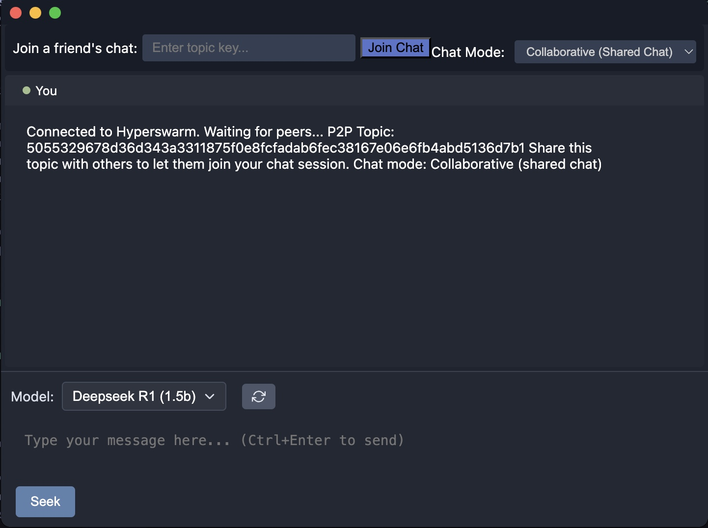
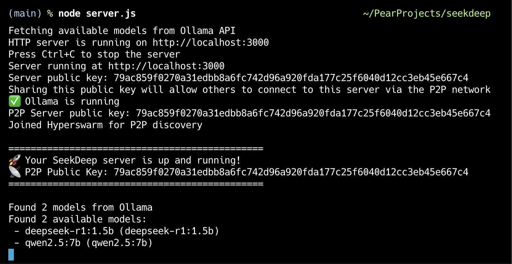

# SeekDeep

A P2P-enabled desktop application that interfaces with local LLMs (Ollama) using Pear Runtime, Hyperswarm, and Hypercore technologies.

## Key Features

- **P2P Networking**: Decentralized connections via Hyperswarm without central servers
- **LLM Integration**: Direct interface with Ollama for local LLM access
- **Dual Chat Modes**: 
  - Collaborative mode where all peers see all messages
  - Private mode where each peer has a separate conversation
- **Model Sharing**: Host shares available models with connected peers
- **Markdown Rendering**: Rich formatting of LLM responses
- **Thinking Content Display**: Visibility into the LLM's reasoning process if available
- **Response Streaming**: Real-time display of LLM responses as they're generated
- **Cross-Platform**: Built with Pear Runtime for desktop support








## Prerequisites

Before running SeekDeep, make sure you have:

1. **Node.js** (v18 or later) and **npm** installed
2. **Pear Runtime** installed (from [Pears.com](https://pears.com)) or just run:
  ```bash
  npx pear
  ```
3. **Ollama** installed and running with at least one model
   - Download from [ollama.ai](https://ollama.ai)
   - Run: `ollama pull deepseek-r1:1.5b` (or another model of your choice)

## Installation if not running through Pear seeding

1. Clone this repository:
   ```bash
   git clone https://github.com/noubre/seekdeep.git
   cd seekdeep
   ```

2. Install dependencies:
   ```bash
   npm install
   ```

## Usage

### Running the Desktop App

1. Make sure Ollama is running with your chosen model.

2. Launch the app in development mode:
   ```bash
   cd seekdeep
   pear run --dev .
   
   // To run more instances:
   pear run --dev path/to/seekdeep

   ```

3. The app window will open, and you can start entering prompts in the text area and clicking "Seek" (or pressing Ctrl+Enter) to get responses.

4. The app will automatically discover and connect to peers on the P2P network using Hyperswarm that have your key.

### Running the Desktop App through Pear seeding

1. Launch from Pear seed:
  ```bash
  pear run [seed]

### Desktop App as Host/Server

The desktop app has built-in server capabilities, which means:

1. You can run the desktop app as either a host or a peer
2. When running as a host, other peers can connect to your instance directly
3. No separate server component is required for most use cases
4. The standalone server is primarily useful for headless environments or remote machines

When you start the app, it automatically runs in host mode until you join an existing chat.

### Running the Server

The server component makes your local Ollama instance accessible over P2P:

1. Make sure Ollama is running with your desired model:
   ```bash
   ollama run deepseek-r1:1.5b
   ```

2. Start the server:
   ```bash
   node server.js
   ```

3. Note the public key displayed in the terminal – this is your server's unique identifier on the P2P network.

> **Note**: The server app is optional and only needed when you want to connect to a remote machine where you can't run the desktop app directly. The desktop app can act as both a client and server/host without requiring the separate server component.


### Model Selection

SeekDeep now supports switching between different LLM models:

1. A model selector dropdown is available in the chat interface.
2. By default, SeekDeep will fetch the list of available models from your local Ollama installation.
3. If you don't have specific models installed, you can install them with Ollama:
   ```bash
   # Install additional models
   ollama pull llama2:7b
   ollama pull mistral:7b
   ollama pull phi:2.7b
   ollama pull gemma:7b
   ```
4. The model selection is used for all subsequent queries until changed.
5. Each peer can choose to interact with a different model from the host.

### Model Sharing Between Host and Peers

When using SeekDeep in a peer-to-peer setup:

1. **Host Models**: The host's available Ollama models are automatically shared with connected peers during the connection handshake.
2. **Peer UI**: Connected peers will see the host's models in their model dropdown instead of their local models.
3. **Model Refresh**: Peers can click the refresh button next to the model dropdown to request the latest models from the host.
4. **No Local Models**: When connected to a host, peers will not fetch or use their local Ollama models, ensuring consistency across the session.
5. **Visual Indication**: A system message informs peers when they're using models from the host.

This ensures that all peers have access to the same models available on the host machine, regardless of what models they have installed locally.

### Collaboration Modes

SeekDeep offers two collaboration modes when interacting with peers:

- **Collaborative Mode**: When a peer sends a query to the host's LLM, both the message and response are visible to everyone in the chat. All peers see all conversations.
- **Private Mode (Default)**: When a peer sends a query, the message and response are only visible to that peer, keeping each user's conversations separate. Note that this is not "private", because the host has access to the logs from Ollama and can see what queries are sent.

Only the host can switch between modes using the dropdown in the UI. When a host changes the mode, all connected peers' chat modes are updated automatically. For security and consistency, all peers start in private mode by default, and mode updates are only accepted from the host or server - not from other peers.

## Project Structure

The SeekDeep project is organized into a modular structure with clear separation of concerns:

```
seekdeep/
├── app.js                 # Main desktop application logic
├── index.html             # Main UI structure and styling
├── server.js              # Optional standalone server component
├── package.json           # Project configuration and dependencies
├── js/                    # JavaScript modules
│   ├── main.js            # Main application entry point
│   ├── llm/               # LLM integration
│   │   ├── models.js      # Model management
│   │   └── ollama.js      # Ollama API integration
│   ├── messages/          # Message handling
│   │   ├── formatting.js  # Message formatting utilities
│   │   └── history.js     # Chat history management
│   ├── network/           # Networking components
│   │   ├── hyperswarm.js  # P2P networking
│   │   └── messaging.js   # Message protocol implementation
│   ├── session/           # Session management
│   │   ├── modes.js       # Chat mode management
│   │   └── peers.js       # Peer connection handling
│   └── ui/                # User interface components
│       ├── elements.js    # UI element creation
│       ├── events.js      # Event handlers
│       └── rendering.js   # Display rendering
├── lib/                   # External libraries
│   └── marked.min.js      # Markdown parser
├── memory-bank/           # Project documentation
│   ├── activeContext.md   # Current work focus
│   ├── productContext.md  # Product context and goals
│   ├── progress.md        # Implementation progress
│   ├── projectbrief.md    # Project overview
│   ├── systemPatterns.md  # System architecture
│   └── techContext.md     # Technical details
├── test/                  # Test files
│   ├── app.test.js        # Unit tests for app.js
│   ├── server.test.js     # Unit tests for server.js
│   ├── integration.test.js # Integration tests
│   ├── e2e.test.js        # End-to-end tests
│   └── setupTests.js      # Test configuration
└── screenshots/           # Application screenshots
    ├── desktop.jpeg       # Desktop UI screenshot
    └── server.jpeg        # Server UI screenshot
```

## Scalability

### Peer Capacity
- The system is designed to handle small to medium-sized collaborative sessions (5-20 peers)
- Performance will vary depending on network conditions and host machine capabilities
- The host bears the primary processing load as all LLM queries are processed through their Ollama instance

### Scalability Factors
- **Host Resources**: The host's CPU, RAM, and GPU capabilities directly impact response times as peer count increases
- **Network Bandwidth**: In collaborative mode, each message is broadcast to all peers, increasing network usage with each additional peer
- **UI Performance**: The chat display must render all messages from all peers, which can become resource-intensive with many active users

### Performance Optimization
- **Private Mode**: For larger groups, using private mode reduces message broadcasting overhead
- **Query Throttling**: The system naturally throttles queries as they are processed sequentially
- **Host Selection**: For optimal performance, the peer with the strongest hardware and network connection should act as host

### Limitations
- No built-in load balancing across multiple peers with Ollama
- No clustering or sharding of conversations
- No persistence of chat history between sessions

## System Architecture

### High-Level Components

```
+-------------------------------------------------------------------------------------------------------------+
|                                             SEEKDEEP APPLICATION                                             |
+-------------------------------------------------------------------------------------------------------------+
                                                      |
                  +-----------------------------------|-----------------------------------+
                  |                                   |                                   |
       +----------v-----------+            +---------v----------+             +----------v-----------+
       |                      |            |                    |             |                      |
       |   User Interface     |            |   P2P Network     |             |   LLM Integration    |
       |                      |            |                    |             |                      |
       +----------+-----------+            +---------+----------+             +----------+-----------+
                  |                                  |                                   |
                  |                                  |                                   |
   +--------------+----------------+     +-----------+---------------+      +------------+-------------+
   |                               |     |                           |      |                          |
   | Components:                   |     | Components:               |      | Components:              |
   | - Chat display                |     | - Hyperswarm connection   |      | - Ollama API client     |
   | - User input form             |     | - Peer connections        |      | - Markdown parser       |
   | - Mode toggle                 |     | - Message handlers        |      | - Response formatter    |
   | - Active user list            |     | - Data serialization      |      | - Query processor       |
   | - Model selector              |     | - Mode management         |      | - Model sharing         |
   | - Refresh models button       |     | - Model distribution      |      |                          |
   |                               |     |                           |      |                          |
   +-------------------------------+     +---------------------------+      +--------------------------+
                  |                                  |                                   |
                  |                                  |                                   |
    +-------------+----------------+      +----------+---------------+      +------------+-------------+
    |                              |      |                          |      |                          |
    | Key Functions:               |      | Key Functions:           |      | Key Functions:           |
    | - createMessageElement()     |      | - initializeNewChat()    |      | - ask()                  |
    | - addToChatHistory()         |      | - joinExistingChat()     |      | - queryLocalLLM()       |
    | - updateChatDisplay()        |      | - setupPeerMessageHandler|      | - handlePeerQuery()     |
    | - renderMarkdown()           |      | - handleMessage()        |      | - parseOllamaResponse() |
    | - updateActiveUsersDisplay() |      | - leaveExistingChat()    |      | - containsMarkdown()    |
    | - updateModelSelect()        |      | - broadcastToPeers()     |      | - fetchAvailableModels()|
    | - requestModelsFromHost()    |      | - handleModelRequest()   |      | - getAvailableModels()  |
    |                              |      |                          |      |                          |
    +------------------------------+      +--------------------------+      +--------------------------+
```

### Data Flow Architecture

```
+--------------------+          +--------------------+          +--------------------+
|                    |  Query   |                    |  Query   |                    |
|       Peer         +--------->+       Host         +--------->+      Ollama        |
|                    |          |                    |          |        API         |
+--------^-----------+          +-------+------------+          +-------+------------+
         |                              |                               |
         |                              |                               |
         |       Response               |        Response               |
         +------------------------------|-------------------------------+
                                        |
                                        v
                 +-------------------+--+-----------------+------------------+
                 |                   |                    |                  |
      +----------v----------+  +----v---------------+ +--v------------------+
      |                     |  |                    | |                     |
      |   Models Sharing    |  |   Mode Management  | |   Message Relay     |
      | (Host -> Peers)     |  | (Host -> Peers)    | | (Peers <-> Peers)   |
      +----------+----------+  +----+---------------+ +--+------------------+
                 |                  |                    |
                 v                  v                    v
      +----------+----------+  +----+---------------+ +--+------------------+
      |                     |  |                    | |                     |
      | Refresh On Demand   |  | Collaborative Mode | | Private Mode        |
      | (Peer -> Host)      |  | (All peers see all | | (Each peer only sees|
      |                     |  |  messages)         | |  their own messages)|
      +---------------------+  +--------------------+ +---------------------+
```

### Message Flow Between Components

```
+------------------+                   +------------------+                  +------------------+
|                  |  1. model_request |                  | 2. Query Ollama  |                  |
|      Peer        +------------------>+      Host        +----------------->+     Ollama API   |
|                  |                   |                  |                  |                  |
+--------^---------+                   +--------^---------+                  +--------+---------+
         |                                      |                                     |
         | 4. Update UI                         | 3. models_update                    |
         |                                      |                                     |
         +--------------------------------------+-------------------------------------+

Mode Update Flow:
+------------------+                   +------------------+                  
|                  |                   |                  |                  
|      Host        +------------------>+      Peer        |                  
|                  |  mode_update      |                  |                  
+------------------+                   +--------^---------+                  
                                                |
                                                | Rejects mode updates
                                                | from non-host peers
+------------------+                   +--------+---------+
|                  |  mode_update      |                  |
|     Other Peer   +------------------>+      Peer        |
|                  |    (Ignored)      |                  |
+------------------+                   +------------------+
```

## Implementation Details

### Mode Management Protocol

The mode management protocol has been enhanced to ensure consistency:

1. **Default Mode**: The system starts in private mode by default (separate chats)
2. **Host Control**: Only the host can change the mode setting
3. **Propagation**: When the host changes mode, the change is broadcast to all peers
4. **Security**: Peers verify the source of mode updates and only accept changes from the host or server
5. **Validation**: Mode updates from non-host peers are logged but ignored

Key benefits of this approach:
- Prevents mode changes when new peers join the network
- Maintains consistent chat mode across all peers
- Prevents potential manipulation of mode settings

### Model Sharing Protocol

The model sharing protocol consists of these key message types:

1. **handshake**: When a peer connects, host automatically shares available models
2. **model_request**: Peer can request models from host (triggered by refresh button)
3. **models_update**: Host sends available models to peers (response to handshake or model_request)

When a peer connects to a host:
1. The host fetches its local Ollama models 
2. The host sends models to the peer using the models_update message
3. The peer updates its UI to show the host's models
4. The peer sets a flag to prevent fetching local models

Peers can also request updated models by clicking the refresh button, which:
1. Sends a model_request message to the host
2. Host fetches current models and sends a models_update response
3. Peer updates the UI with the latest models

### Message Types

| Message Type    | Purpose                                   | Direction        | Validation                   |
|-----------------|-------------------------------------------|------------------|------------------------------|
| handshake       | Initialize connection                     | Peer → Host      | -                            |
| handshake_ack   | Acknowledge connection                    | Host → Peer      | -                            |
| models_update   | Share available models                    | Host → Peer      | -                            |
| model_request   | Request available models                  | Peer → Host      | -                            |
| query           | Send LLM query                            | Peer → Host      | -                            |
| response        | Stream LLM response                       | Host → Peer      | -                            |
| mode_update     | Change collaboration mode                 | Host → Peer      | Must come from host/server   |
| peer_message    | Relay messages between peers              | Peer ↔ Peer      | -                            |

### Message Examples

Below are examples of the actual JSON message structures used in the P2P communication:

#### Handshake Message (Peer → Host)
```json
{
  "type": "handshake",
  "clientId": "a1b2c3d4e5f6...",
  "displayName": "Peer1"
}
```

#### Handshake Acknowledgment (Host → Peer)
```json
{
  "type": "handshake_ack",
  "status": "connected",
  "hostId": "z9y8x7w6v5u...",
  "isCollaborativeMode": false
}
```

#### Models Update Message (Host → Peer)
```json
{
  "type": "models_update",
  "models": [
    {
      "name": "llama2:7b",
      "modified_at": "2025-03-01T10:30:45.000Z",
      "size": 4200000000,
      "digest": "sha256:a1b2c3..."
    },
    {
      "name": "deepseek-coder:6.7b",
      "modified_at": "2025-03-05T14:22:10.000Z",
      "size": 3800000000,
      "digest": "sha256:d4e5f6..."
    }
  ]
}
```

#### Model Request Message (Peer → Host)
```json
{
  "type": "model_request"
}
```

#### Query Message (Peer → Host)
```json
{
  "type": "query",
  "model": "llama2:7b",
  "prompt": "Explain quantum computing in simple terms",
  "requestId": "req_1234567890",
  "fromPeerId": "a1b2c3d4e5f6..."
}
```

#### Response Message (Host → Peer)
```json
{
  "type": "response",
  "data": "Quantum computing uses quantum bits or qubits...",
  "requestId": "req_1234567890",
  "isComplete": false,
  "fromPeerId": "a1b2c3d4e5f6..."
}
```

#### Mode Update Message (Host → Peer)
```json
{
  "type": "mode_update",
  "isCollaborativeMode": true
}
```

#### Peer Message (Peer → Server → Other Peers)
```json
{
  "type": "peer_message",
  "content": {
    "type": "user",
    "fromPeer": "Peer1",
    "message": "Hello, can someone help me understand transformers?",
    "timestamp": 1647382941253
  }
}
```

## Collaboration Modes

SeekDeep offers two collaboration modes when interacting with peers:

- **Collaborative Mode**: When a peer sends a query to the host's LLM, both the message and response are visible to everyone in the chat. All peers see all conversations.
- **Private Mode (Default)**: When a peer sends a query, the message and response are only visible to that peer, keeping each user's conversation private.

Only the host can switch between modes using the dropdown in the UI. When the host changes modes, all connected peers' chat modes are updated automatically. The system now verifies that mode updates only come from the host or server, preventing new peers from inadvertently changing the modes of existing peers.

### Collaboration Flow

When in collaborative mode:
1. All messages from all peers are broadcast to everyone
2. Each message includes a "fromPeer" attribution
3. The host processes all LLM queries and broadcasts responses to all peers

When in private mode (default):
1. Each peer's messages and responses are only visible to that peer
2. Messages are only sent to the specific target peer
3. The host processes LLM queries but only returns responses to the requesting peer
