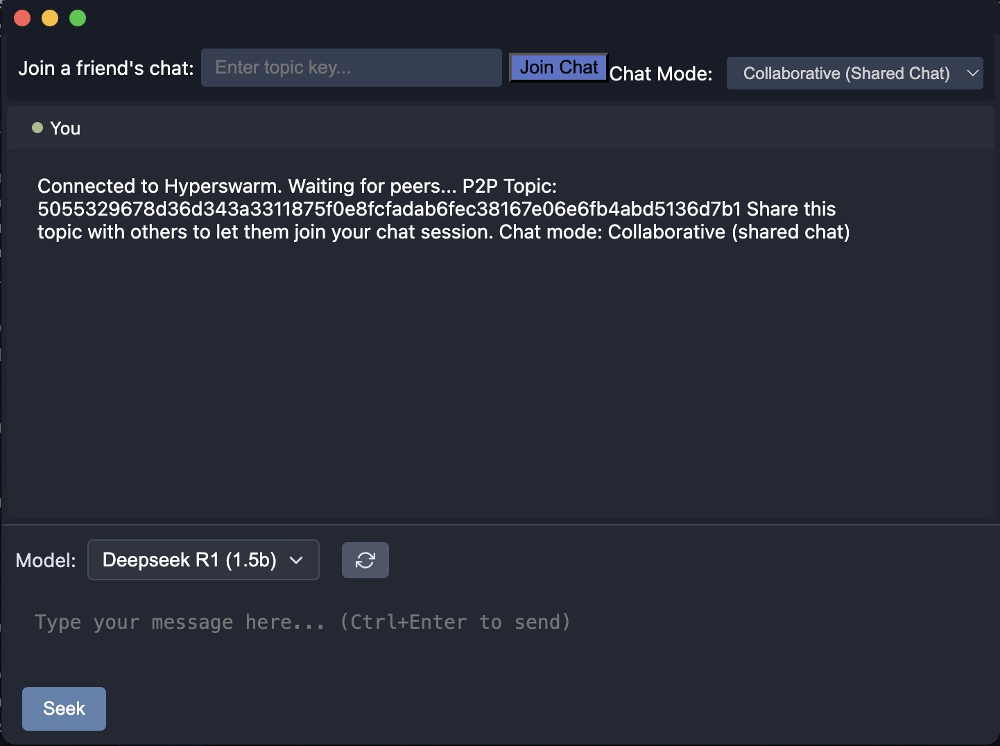
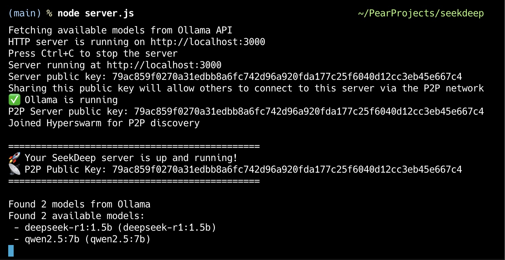

# SeekDeep

A P2P-enabled desktop application that interfaces with multiple local LLM providers (Ollama and LM Studio) using Pear Runtime, Hyperswarm, and Hypercore technologies. Built with a modern modular ES6 architecture for maintainability and extensibility.

## Key Features

- **Multi-Provider LLM Support**: Seamless integration with Ollama and LM Studio
- **Provider Auto-Detection**: Automatic discovery and selection of available LLM providers
- **P2P Networking**: Decentralized connections via Hyperswarm without central servers
- **Modular Architecture**: Clean ES6 module system with separation of concerns
- **Dual Chat Modes**: 
  - Collaborative mode where all peers see all messages
  - Private mode where each peer has a separate conversation
- **Model Sharing**: Host shares available models from active provider with connected peers
- **Provider Switching**: Runtime switching between different LLM providers
- **Markdown Rendering**: Rich formatting of LLM responses
- **Thinking Content Display**: Visibility into the LLM's reasoning process if available
- **Response Streaming**: Real-time display of LLM responses as they're generated
- **Cross-Platform**: Built with Pear Runtime for desktop support








## Prerequisites

Before running SeekDeep, make sure you have:

1. **Node.js** (v18 or later) and **npm** installed
2. **Pear Runtime** installed (from [Pears.com](https://pears.com)) or just run:
   ```bash
   npx pear
   ```
3. **At least one LLM provider** installed and running:

### Option A: Ollama (Recommended)
- Download from [ollama.ai](https://ollama.ai)
- Install and run a model:
  ```bash
  ollama pull deepseek-r1:1.5b
  ollama serve  # Runs on port 11434
  ```

### Option B: LM Studio
- Download from [lmstudio.ai](https://lmstudio.ai)
- Install and load a model
- Start the local server (typically runs on port 1234)

### Option C: Both Providers
- Install both Ollama and LM Studio for maximum flexibility
- SeekDeep will auto-detect available providers and allow switching between them

## Installation if not running through Pear seeding

1. Clone this repository:
   ```bash
   git clone https://github.com/noubre/seekdeep.git
   cd seekdeep
   ```

2. Install dependencies:
   ```bash
   npm install
   ```

## Usage

### Running the Desktop App

1. **Start your LLM provider(s):**

   **For Ollama:**
   ```bash
   ollama serve
   ollama ps  # Check running models
   ```

   **For LM Studio:**
   - Open LM Studio
   - Load a model
   - Start the local server (usually on port 1234)

2. **Launch the app in development mode:**
   ```bash
   cd seekdeep
   pear run --dev .
   
   # Or:
   pear run --dev path/to/seekdeep
   ```

3. **Using the app:**
   - The app window will open and auto-detect available providers
   - Select your preferred provider from the dropdown (if multiple are available)
   - Choose a model from the model dropdown
   - Start entering prompts in the text area and click "Seek" (or press Ctrl+Enter)
   - The app will automatically discover and connect to peers on the P2P network using Hyperswarm

4. **Provider Features:**
   - **Auto-Detection**: The app automatically detects which providers are running
   - **Provider Switching**: Switch between Ollama and LM Studio at runtime
   - **Model Sync**: When connected to peers, model lists sync from the host's active provider

### Running the Desktop App through Pear seeding

1. Launch from Pear seed:
  ```bash
  pear run [seed]

  ```

### Desktop App as Host/Server

The desktop app has built-in server capabilities, which means:

1. You can run the desktop app as either a host or a peer
2. When running as a host, other peers can connect to your instance directly
3. No separate server component is required for most use cases
4. The standalone server is primarily useful for headless environments or remote machines

When you start the app, it automatically runs in host mode until you join an existing chat.

### Running the Server

The server component makes your local LLM providers accessible over P2P:

1. **Make sure at least one LLM provider is running:**

   **For Ollama:**
   ```bash
   ollama serve
   ollama run deepseek-r1:1.5b
   ```

   **For LM Studio:**
   - Start LM Studio with a loaded model and local server enabled

2. **Start the server:**
   ```bash
   node server.js
   ```

3. **Server Features:**
   - Auto-detects available providers (Ollama and/or LM Studio)
   - Proxies requests to the appropriate provider
   - Displays the public key for P2P identification
   - Supports switching between providers if multiple are available

> **Note**: The server app is optional and only needed when you want to connect to a remote machine where you can't run the desktop app directly. The desktop app can act as both a client and server/host without requiring the separate server component.


### Provider and Model Selection

SeekDeep supports multiple LLM providers and models:

#### Provider Selection
1. **Provider Dropdown**: Available in the chat interface when multiple providers are detected
2. **Auto-Detection**: SeekDeep automatically detects running providers (Ollama, LM Studio)
3. **Runtime Switching**: Switch between providers without restarting the application
4. **Status Indicators**: Visual indicators show provider availability and connection status

#### Model Selection
1. **Model Dropdown**: Shows models available from the currently selected provider
2. **Provider-Specific Models**: Model list updates when switching providers
3. **Host Synchronization**: When connected to a host, peers see the host's provider and models
4. **Refresh Capability**: Refresh button updates the model list from the active provider

#### Installing Additional Models

**For Ollama:**
```bash
# Install additional models
ollama pull llama2:7b
ollama pull mistral:7b
ollama pull phi:2.7b
ollama pull gemma:7b
ollama pull deepseek-coder:6.7b
```

**For LM Studio:**
- Use the LM Studio interface to download and manage models
- Models appear automatically in SeekDeep when loaded in LM Studio

#### Usage Notes
- Model selection applies to all subsequent queries until changed
- Each peer can interact with different models from the host's active provider
- Provider switching affects the entire session for the host and all connected peers

### Provider and Model Sharing Between Host and Peers

When using SeekDeep in a peer-to-peer setup:

1. **Host Provider Sharing**: The host's active provider and available models are automatically shared with connected peers during the connection handshake.

2. **Peer Synchronization**: Connected peers will see:
   - The host's active provider in their provider dropdown
   - The host's available models in their model dropdown
   - Provider status and connection information

3. **Dynamic Updates**: When the host switches providers:
   - All peers are notified of the provider change
   - Model lists are automatically updated across all peers
   - Ongoing conversations continue seamlessly

4. **Model Refresh**: Peers can click the refresh button to request the latest models from the host's active provider.

5. **Provider Consistency**: When connected to a host, peers use the host's provider and models, ensuring consistency across the session regardless of what providers/models peers have installed locally.

6. **Visual Indicators**: System messages inform peers about:
   - Which provider they're using (host's provider)
   - When the host switches providers
   - Model availability and updates

This ensures that all peers have access to the same provider and models available on the host machine, creating a unified collaborative experience.

### Collaboration Modes

SeekDeep offers two collaboration modes when interacting with peers:

- **Collaborative Mode**: When a peer sends a query to the host's LLM provider, both the message and response are visible to everyone in the chat. All peers see all conversations and can observe the collaborative problem-solving process.

- **Private Mode (Default)**: When a peer sends a query, the message and response are only visible to that peer, keeping each user's conversations separate. Note that this is not truly "private" since the host processes all queries and has access to provider logs.

#### Mode Management
- **Host Control**: Only the host can switch between modes using the dropdown in the UI
- **Automatic Synchronization**: When a host changes the mode, all connected peers' chat modes are updated automatically
- **Security**: For consistency and security, mode updates are only accepted from the host or server - not from other peers
- **Default Behavior**: All sessions start in private mode by default
- **Provider Independence**: Mode settings work consistently across all supported providers (Ollama, LM Studio)

The collaboration mode affects how queries and responses are shared, but the underlying provider and model selection remain consistent across all peers in the session.

## Project Structure

SeekDeep is built with a modern modular ES6 architecture for maintainability and extensibility:

```
seekdeep/
├── js/                    # Modular JavaScript architecture
│   ├── main.js            # Main application bootstrap
│   ├── ui/                # User interface modules
│   │   ├── elements.js    # DOM element management
│   │   ├── events.js      # Event handling
│   │   └── rendering.js   # Display rendering
│   ├── llm/               # LLM provider modules
│   │   ├── provider.js    # Provider abstraction layer
│   │   ├── ollama.js      # Ollama integration
│   │   ├── lmstudio.js    # LM Studio integration
│   │   └── models.js      # Model management
│   ├── network/           # P2P networking modules
│   │   ├── hyperswarm.js  # P2P connection management
│   │   └── messaging.js   # Message protocol
│   ├── session/           # Session management modules
│   │   ├── modes.js       # Chat mode management
│   │   └── peers.js       # Peer state management
│   └── messages/          # Message handling modules
│       ├── formatting.js  # Message formatting
│       └── history.js     # Chat history
├── index.html             # Main UI structure and styling
├── server.js              # Optional standalone server component
├── package.json           # Project configuration and dependencies
├── lib/                   # External libraries
│   └── marked.min.js      # Markdown parser
├── memory-bank/           # Project documentation
│   ├── activeContext.md   # Current development context
│   ├── productContext.md  # Product goals and context
│   ├── progress.md        # Implementation progress
│   ├── projectbrief.md    # Project overview
│   ├── systemPatterns.md  # Architecture patterns
│   └── techContext.md     # Technical details
├── test/                  # Test files
│   ├── app.test.js        # Unit tests for core app
│   ├── server.test.js     # Unit tests for server
│   ├── integration.test.js # Integration tests
│   ├── e2e.test.js        # End-to-end tests
│   ├── simple.test.js     # Simple test scenarios
│   └── direct.test.js     # Direct API tests
└── screenshots/           # Application screenshots
    ├── desktop.jpeg       # Desktop UI screenshot
    └── server.jpeg        # Server UI screenshot
```

### Architecture Benefits

- **Modular Design**: Each module has a focused responsibility and clear boundaries
- **ES6 Modules**: Modern import/export system for clean dependencies
- **Provider Abstraction**: Easy to add new LLM providers without changing core logic
- **Separation of Concerns**: UI, networking, LLM integration, and session management are isolated
- **Testability**: Modular structure enables targeted unit and integration testing
- **Maintainability**: Clear organization makes the codebase easy to understand and modify

## Scalability

### Peer Capacity
- The system is designed to handle small to medium-sized collaborative sessions (5-20 peers)
- Performance will vary depending on network conditions and host machine capabilities
- The host bears the primary processing load as all LLM queries are processed through their Ollama instance

### Scalability Factors
- **Host Resources**: The host's CPU, RAM, and GPU capabilities directly impact response times as peer count increases
- **Network Bandwidth**: In collaborative mode, each message is broadcast to all peers, increasing network usage with each additional peer
- **UI Performance**: The chat display must render all messages from all peers, which can become resource-intensive with many active users

### Performance Optimization
- **Individual Mode**: For larger groups, using individual mode reduces message broadcasting overhead
- **Query Throttling**: The system naturally throttles queries as they are processed sequentially
- **Host Selection**: For optimal performance, the peer with the strongest hardware and network connection should act as host

### Limitations
- No built-in load balancing across multiple peers with Ollama
- No clustering or sharding of conversations
- No persistence of chat history between sessions

## System Architecture

### High-Level Components

```
+-------------------------------------------------------------------------------------------------------------+
|                                             SEEKDEEP APPLICATION                                             |
+-------------------------------------------------------------------------------------------------------------+
                                                      |
                  +-----------------------------------|-----------------------------------+
                  |                                   |                                   |
       +----------v-----------+            +---------v----------+             +----------v-----------+
       |                      |            |                    |             |                      |
       |   User Interface     |            |   P2P Network     |             |   LLM Integration    |
       |                      |            |                    |             |                      |
       +----------+-----------+            +---------+----------+             +----------+-----------+
                  |                                  |                                   |
                  |                                  |                                   |
   +--------------+----------------+     +-----------+---------------+      +------------+-------------+
   |                               |     |                           |      |                          |
   | Components:                   |     | Components:               |      | Components:              |
   | - Chat display                |     | - Hyperswarm connection   |      | - Ollama API client     |
   | - User input form             |     | - Peer connections        |      | - Markdown parser       |
   | - Mode toggle                 |     | - Message handlers        |      | - Response formatter    |
   | - Active user list            |     | - Data serialization      |      | - Query processor       |
   | - Model selector              |     | - Mode management         |      | - Model sharing         |
   | - Refresh models button       |     | - Model distribution      |      |                          |
   |                               |     |                           |      |                          |
   +-------------------------------+     +---------------------------+      +--------------------------+
                  |                                  |                                   |
                  |                                  |                                   |
    +-------------+----------------+      +----------+---------------+      +------------+-------------+
    |                              |      |                          |      |                          |
    | Key Functions:               |      | Key Functions:           |      | Key Functions:           |
    | - createMessageElement()     |      | - initializeNewChat()    |      | - ask()                  |
    | - addToChatHistory()         |      | - joinExistingChat()     |      | - queryLocalLLM()       |
    | - updateChatDisplay()        |      | - setupPeerMessageHandler|      | - handlePeerQuery()     |
    | - renderMarkdown()           |      | - handleMessage()        |      | - parseOllamaResponse() |
    | - updateActiveUsersDisplay() |      | - leaveExistingChat()    |      | - containsMarkdown()    |
    | - updateModelSelect()        |      | - broadcastToPeers()     |      | - fetchAvailableModels()|
    | - requestModelsFromHost()    |      | - handleModelRequest()   |      | - getAvailableModels()  |
    |                              |      |                          |      |                          |
    +------------------------------+      +--------------------------+      +--------------------------+
```

### Data Flow Architecture

```
+--------------------+          +--------------------+          +--------------------+
|                    |  Query   |                    |  Query   |                    |
|       Peer         +--------->+       Host         +--------->+      Ollama        |
|                    |          |                    |          |        API         |
+--------^-----------+          +-------+------------+          +-------+------------+
         |                              |                               |
         |                              |                               |
         |       Response               |        Response               |
         +------------------------------|-------------------------------+
                                        |
                                        v
                 +-------------------+--+-----------------+------------------+
                 |                   |                    |                  |
      +----------v----------+  +----v---------------+ +--v------------------+
      |                     |  |                    | |                     |
      |   Models Sharing    |  |   Mode Management  | |   Message Relay     |
      | (Host -> Peers)     |  | (Host -> Peers)    | | (Peers <-> Peers)   |
      +----------+----------+  +----+---------------+ +--+------------------+
                 |                  |                    |
                 v                  v                    v
      +----------+----------+  +----+---------------+ +--+------------------+
      |                     |  |                    | |                     |
      | Refresh On Demand   |  | Collaborative Mode | | Individual Mode     |
      | (Peer -> Host)      |  | (All peers see all | | (Each peer only sees|
      |                     |  |  messages)         | |  their own messages)|
      +---------------------+  +--------------------+ +---------------------+
```

### Message Flow Between Components

```
+------------------+                   +------------------+                  +------------------+
|                  |  1. model_request |                  | 2. Query Ollama  |                  |
|      Peer        +------------------>+      Host        +----------------->+     Ollama API   |
|                  |                   |                  |                  |                  |
+--------^---------+                   +--------^---------+                  +--------+---------+
         |                                      |                                     |
         | 4. Update UI                         | 3. models_update                    |
         |                                      |                                     |
         +--------------------------------------+-------------------------------------+

Mode Update Flow:
+------------------+                   +------------------+                  
|                  |                   |                  |                  
|      Host        +------------------>+      Peer        |                  
|                  |  mode_update      |                  |                  
+------------------+                   +--------^---------+                  
                                                |
                                                | Rejects mode updates
                                                | from non-host peers
+------------------+                   +--------+---------+
|                  |  mode_update      |                  |
|     Other Peer   +------------------>+      Peer        |
|                  |    (Ignored)      |                  |
+------------------+                   +------------------+
```

## Implementation Details

### Mode Management Protocol

The mode management protocol has been enhanced to ensure consistency:

1. **Default Mode**: The system starts in individual mode by default (separate chats)
2. **Host Control**: Only the host can change the mode setting
3. **Propagation**: When the host changes mode, the change is broadcast to all peers
4. **Security**: Peers verify the source of mode updates and only accept changes from the host or server
5. **Validation**: Mode updates from non-host peers are logged but ignored

Key benefits of this approach:
- Prevents mode changes when new peers join the network
- Maintains consistent chat mode across all peers
- Prevents potential manipulation of mode settings

### Model Sharing Protocol

The model sharing protocol consists of these key message types:

1. **handshake**: When a peer connects, host automatically shares available models
2. **model_request**: Peer can request models from host (triggered by refresh button)
3. **models_update**: Host sends available models to peers (response to handshake or model_request)

When a peer connects to a host:
1. The host fetches its local Ollama models 
2. The host sends models to the peer using the models_update message
3. The peer updates its UI to show the host's models
4. The peer sets a flag to prevent fetching local models

Peers can also request updated models by clicking the refresh button, which:
1. Sends a model_request message to the host
2. Host fetches current models and sends a models_update response
3. Peer updates the UI with the latest models

### Message Types

| Message Type    | Purpose                                   | Direction        | Validation                   |
|-----------------|-------------------------------------------|------------------|------------------------------|
| handshake       | Initialize connection                     | Peer → Host      | -                            |
| handshake_ack   | Acknowledge connection                    | Host → Peer      | -                            |
| models_update   | Share available models                    | Host → Peer      | -                            |
| model_request   | Request available models                  | Peer → Host      | -                            |
| query           | Send LLM query                            | Peer → Host      | -                            |
| response        | Stream LLM response                       | Host → Peer      | -                            |
| mode_update     | Change collaboration mode                 | Host → Peer      | Must come from host/server   |
| peer_message    | Relay messages between peers              | Peer ↔ Peer      | -                            |

### Message Examples

Below are examples of the actual JSON message structures used in the P2P communication:

#### Handshake Message (Peer → Host)
```json
{
  "type": "handshake",
  "clientId": "a1b2c3d4e5f6...",
  "displayName": "Peer1"
}
```

#### Handshake Acknowledgment (Host → Peer)
```json
{
  "type": "handshake_ack",
  "status": "connected",
  "hostId": "z9y8x7w6v5u...",
  "isCollaborativeMode": false
}
```

#### Models Update Message (Host → Peer)
```json
{
  "type": "models_update",
  "models": [
    {
      "name": "llama2:7b",
      "modified_at": "2025-03-01T10:30:45.000Z",
      "size": 4200000000,
      "digest": "sha256:a1b2c3..."
    },
    {
      "name": "deepseek-coder:6.7b",
      "modified_at": "2025-03-05T14:22:10.000Z",
      "size": 3800000000,
      "digest": "sha256:d4e5f6..."
    }
  ]
}
```

#### Model Request Message (Peer → Host)
```json
{
  "type": "model_request"
}
```

#### Query Message (Peer → Host)
```json
{
  "type": "query",
  "model": "llama2:7b",
  "prompt": "Explain quantum computing in simple terms",
  "requestId": "req_1234567890",
  "fromPeerId": "a1b2c3d4e5f6..."
}
```

#### Response Message (Host → Peer)
```json
{
  "type": "response",
  "data": "Quantum computing uses quantum bits or qubits...",
  "requestId": "req_1234567890",
  "isComplete": false,
  "fromPeerId": "a1b2c3d4e5f6..."
}
```

#### Mode Update Message (Host → Peer)
```json
{
  "type": "mode_update",
  "isCollaborativeMode": true
}
```

#### Peer Message (Peer → Server → Other Peers)
```json
{
  "type": "peer_message",
  "content": {
    "type": "user",
    "fromPeer": "Peer1",
    "message": "Hello, can someone help me understand transformers?",
    "timestamp": 1647382941253
  }
}
```
