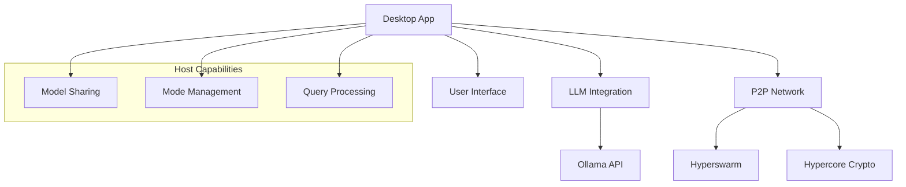
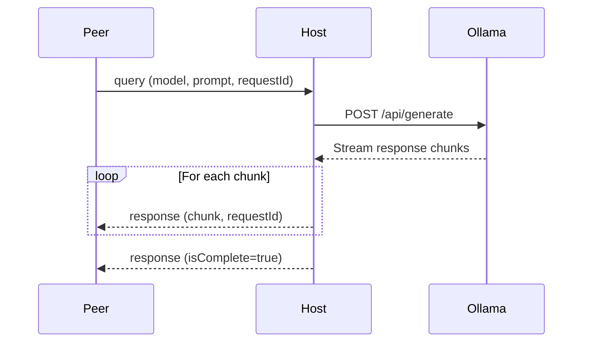
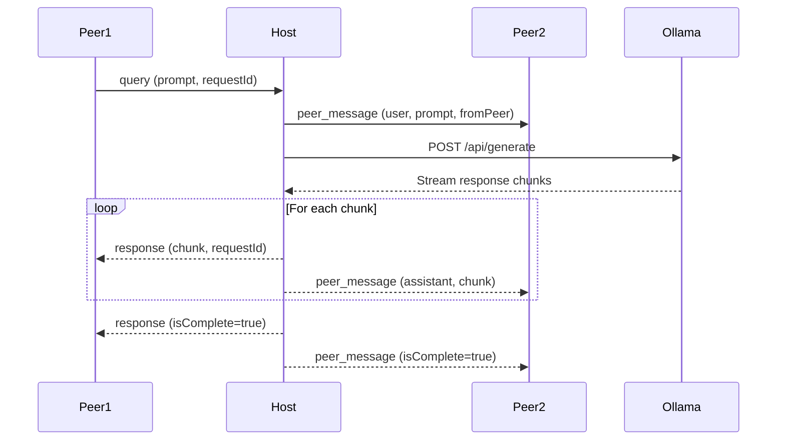
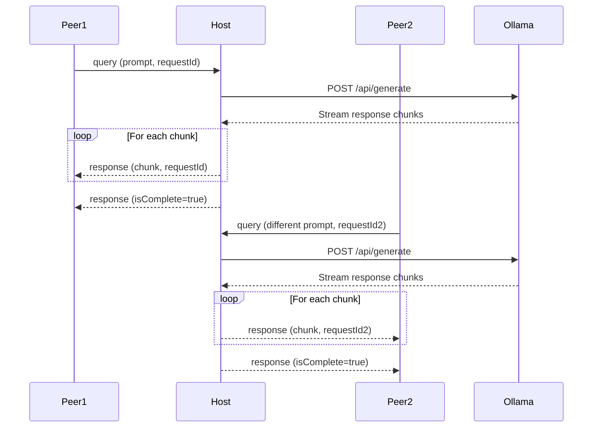

# System Patterns: SeekDeep

## Architecture Overview
SeekDeep follows a hybrid client-server and peer-to-peer architecture with clear separation of concerns:

## Key Components

### Desktop Application (app.js)
- **User Interface**: Handles rendering and user interactions
- **P2P Networking**: Manages peer connections and message handling
- **LLM Integration**: Interfaces with Ollama API
- **Host/Peer Logic**: Implements different behaviors based on role

### Server Component (server.js)
- **HTTP Server**: Provides API endpoints for local access
- **P2P Server**: Enables remote connections to Ollama
- **Proxy Logic**: Routes requests to Ollama API

### P2P Communication
- **Connection Management**: Handles peer discovery and connections
- **Message Protocol**: Defines structured message types for different operations
- **Role-Based Logic**: Different behaviors for hosts vs. peers

## Design Patterns

### Host-Peer Pattern
- **Host Role**: 
  - Initiates a session with a unique topic
  - Processes LLM queries for all peers
  - Controls chat mode (collaborative vs. private)
  - Shares available models with peers
- **Peer Role**:
  - Joins an existing session using a topic key
  - Sends queries to the host for processing
  - Receives responses from the host
  - Uses the host's available models

### Message Handling Pattern
- **Message Types**: Structured message objects with type field
- **Type-Based Routing**: Handler functions based on message type
- **Request-Response Flow**: Unique request IDs for tracking
- **Streaming Pattern**: Chunked responses with completion flags

### Mode Management Pattern
- **Centralized Control**: Only host can change modes
- **Propagation**: Mode changes broadcast to all peers
- **Validation**: Peers verify mode updates come from host
- **Default Safety**: System starts in private mode

### Model Sharing Pattern
- **Discovery**: Host shares available models during handshake
- **On-Demand Updates**: Peers can request refreshed model list
- **UI Integration**: Peer UI shows host's available models
- **Fallback**: Default models when connection fails

## Data Flow Patterns

### Query Flow

### Collaborative Mode Flow

### Private Mode Flow

## Error Handling Patterns
- **Connection Errors**: Automatic reconnection attempts
- **LLM Errors**: Graceful degradation with error messages
- **Message Parsing**: Try-catch blocks for JSON parsing
- **API Failures**: Fallback to default models or local processing

## Testing Patterns
- **Unit Tests**: Individual component testing
- **Integration Tests**: Cross-component interaction testing
- **Mock Objects**: Simulation of external dependencies
- **Test Fixtures**: Predefined test data and environments
