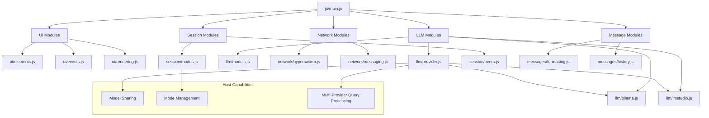
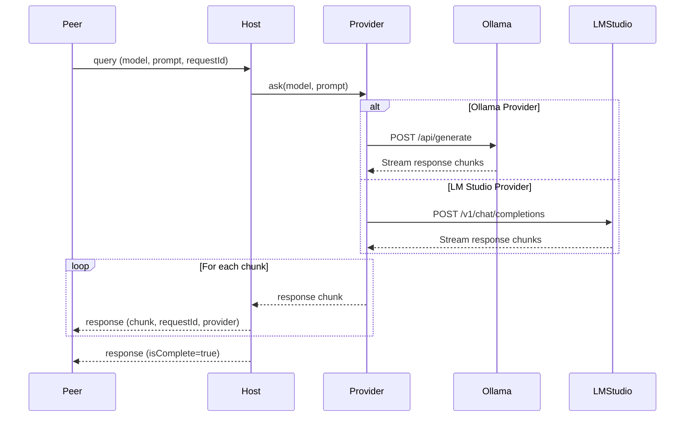
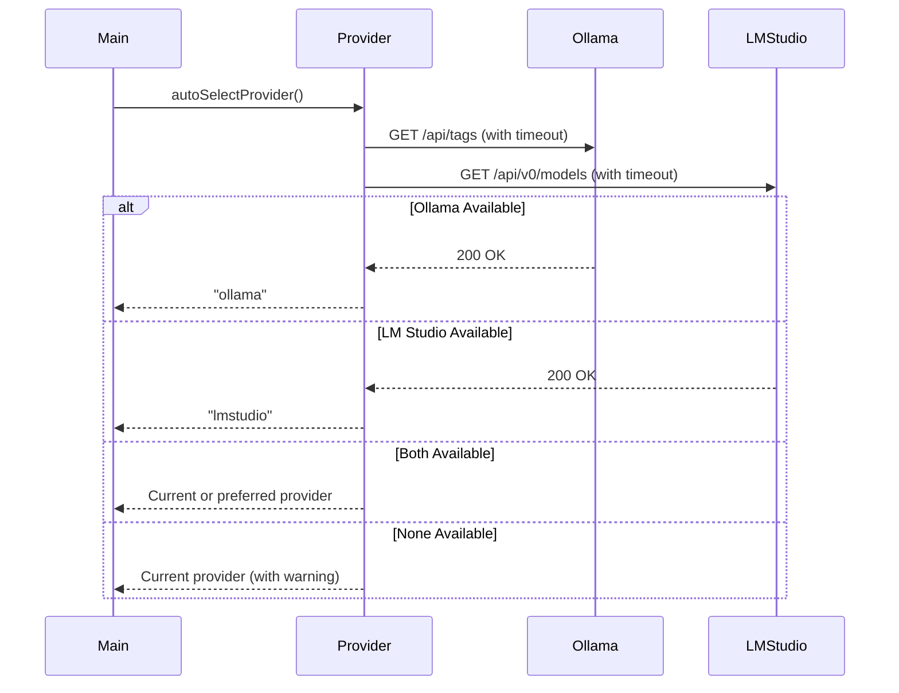
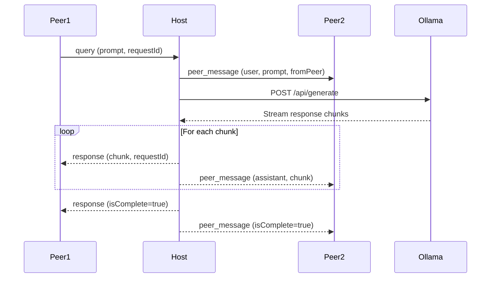
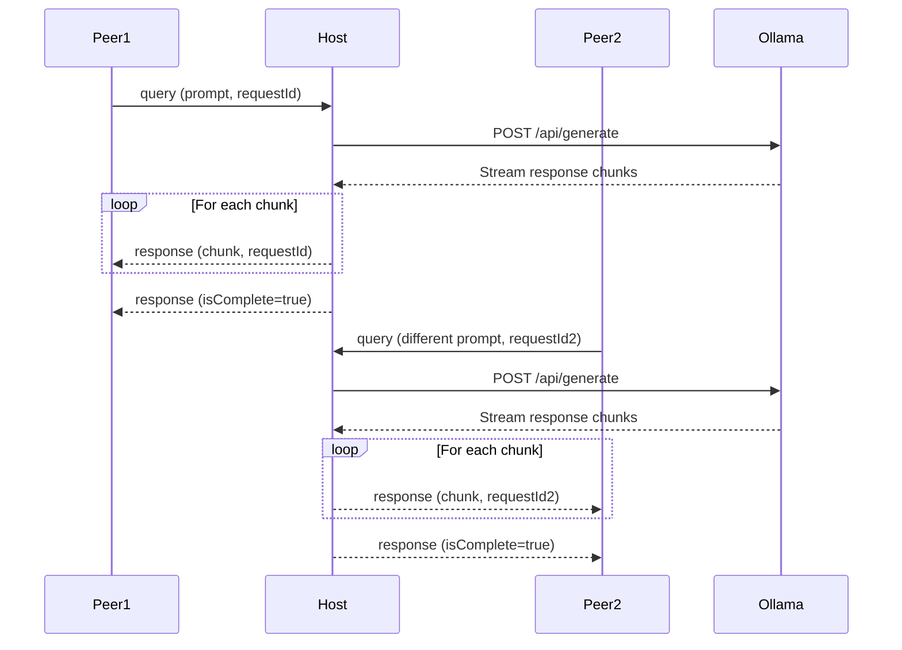

# System Patterns: SeekDeep

**Last Updated:** November 15, 2025

## Architecture Overview
SeekDeep follows a modular hybrid client-server and peer-to-peer architecture with clear separation of concerns across ES6 modules:

```mermaid
graph TD
    Main[js/main.js] --> UI[UI Modules]
    Main --> LLM[LLM Modules]
    Main --> Network[Network Modules]
    Main --> Session[Session Modules]
    Main --> Messages[Message Modules]
    
    UI --> Elements[ui/elements.js]
    UI --> Events[ui/events.js]
    UI --> Rendering[ui/rendering.js]
    
    LLM --> Provider[llm/provider.js]
    LLM --> Ollama[llm/ollama.js]
    LLM --> LMStudio[llm/lmstudio.js]
    LLM --> Models[llm/models.js]
    
    Network --> Hyperswarm[network/hyperswarm.js]
    Network --> Messaging[network/messaging.js]
    
    Session --> Modes[session/modes.js]
    Session --> Peers[session/peers.js]
    
    Messages --> Formatting[messages/formatting.js]
    Messages --> History[messages/history.js]
    
    Provider --> Ollama
    Provider --> LMStudio
    
    subgraph "Host Capabilities"
        ModelSharing[Model Sharing]
        ModeManagement[Mode Management]
        QueryProcessing[Multi-Provider Query Processing]
    end
    
    Provider --> ModelSharing
    Modes --> ModeManagement
    Provider --> QueryProcessing
```

## Key Components

### Modular Architecture (js/ directory)
The application is organized into focused modules with clear responsibilities:

#### Core Bootstrap (js/main.js)
- **Application Initialization**: Bootstraps all modules in correct order
- **Module Coordination**: Manages inter-module communication
- **Event System**: Sets up global event listeners and dispatchers

#### UI Modules (js/ui/)
- **elements.js**: DOM element creation and management
- **events.js**: Event handler setup and user interaction management
- **rendering.js**: Display rendering and UI updates

#### LLM Modules (js/llm/)
- **provider.js**: Provider abstraction layer and auto-detection
- **ollama.js**: Ollama-specific API integration
- **lmstudio.js**: LM Studio-specific API integration
- **models.js**: Model management and fetching across providers

#### Network Modules (js/network/)
- **hyperswarm.js**: P2P networking and connection management
- **messaging.js**: Message protocol implementation and handling

#### Session Modules (js/session/)
- **modes.js**: Chat mode management (collaborative/private)
- **peers.js**: Peer connection and state management

#### Message Modules (js/messages/)
- **formatting.js**: Message formatting and markdown processing
- **history.js**: Chat history management and persistence

### Server Component (server.js)
- **HTTP Server**: Provides API endpoints for local access
- **Multi-Provider Proxy**: Routes requests to Ollama or LM Studio
- **P2P Server**: Enables remote connections to LLM providers

### Provider System
- **Abstraction Layer**: Unified interface for all LLM providers
- **Auto-Detection**: Automatic discovery of available providers
- **Runtime Switching**: Dynamic provider selection and switching
- **Health Monitoring**: Provider availability and status checking

## Design Patterns

### Module Pattern (ES6)
- **Encapsulation**: Each module encapsulates specific functionality
- **Explicit Dependencies**: Clear import/export statements
- **Separation of Concerns**: Focused responsibilities per module
- **Testability**: Isolated modules enable targeted testing

### Provider Pattern
- **Abstraction**: Common interface for all LLM providers
- **Strategy**: Runtime selection of provider implementation
- **Auto-Detection**: Automatic discovery and availability checking
- **Fallback**: Graceful degradation when providers unavailable

### Host-Peer Pattern
- **Host Role**: 
  - Initiates a session with a unique topic
  - Processes LLM queries for all peers using selected provider
  - Controls chat mode (collaborative vs. private)
  - Shares available models from active provider with peers
- **Peer Role**:
  - Joins an existing session using a topic key
  - Sends queries to the host for processing
  - Receives responses from the host's provider
  - Uses the host's available models and provider

### Message Handling Pattern
- **Message Types**: Structured message objects with type field
- **Type-Based Routing**: Handler functions based on message type
- **Request-Response Flow**: Unique request IDs for tracking
- **Streaming Pattern**: Chunked responses with completion flags
- **Provider Context**: Messages include provider information

### Mode Management Pattern
- **Centralized Control**: Only host can change modes
- **Propagation**: Mode changes broadcast to all peers
- **Validation**: Peers verify mode updates come from host
- **Default Safety**: System starts in private mode

### Model Sharing Pattern
- **Provider-Aware Discovery**: Host shares models from active provider
- **On-Demand Updates**: Peers can request refreshed model list
- **UI Integration**: Peer UI shows host's provider and models
- **Provider Switching**: Model list updates when host changes provider

## Data Flow Patterns

### Multi-Provider Query Flow

```mermaid
sequenceDiagram
    participant Peer
    participant Host
    participant Provider
    participant Ollama
    participant LMStudio
    
    Peer->>Host: query (model, prompt, requestId)
    Host->>Provider: ask(model, prompt)
    
    alt Ollama Provider
        Provider->>Ollama: POST /api/generate
        Ollama-->>Provider: Stream response chunks
    else LM Studio Provider
        Provider->>LMStudio: POST /v1/chat/completions
        LMStudio-->>Provider: Stream response chunks
    end
    
    loop For each chunk
        Provider-->>Host: response chunk
        Host-->>Peer: response (chunk, requestId, provider)
    end
    Host-->>Peer: response (isComplete=true)
```

### Provider Auto-Detection Flow

```mermaid
sequenceDiagram
    participant Main
    participant Provider
    participant Ollama
    participant LMStudio
    
    Main->>Provider: autoSelectProvider()
    Provider->>Ollama: GET /api/tags (with timeout)
    Provider->>LMStudio: GET /api/v0/models (with timeout)
    
    alt Ollama Available
        Ollama-->>Provider: 200 OK
        Provider-->>Main: "ollama"
    else LM Studio Available
        LMStudio-->>Provider: 200 OK
        Provider-->>Main: "lmstudio"
    else Both Available
        Provider-->>Main: Current or preferred provider
    else None Available
        Provider-->>Main: Current provider (with warning)
    end
```

### Collaborative Mode Flow

```mermaid
sequenceDiagram
    participant Peer1
    participant Host
    participant Peer2
    participant Ollama
    
    Peer1->>Host: query (prompt, requestId)
    Host->>Peer2: peer_message (user, prompt, fromPeer)
    Host->>Ollama: POST /api/generate
    Ollama-->>Host: Stream response chunks
    loop For each chunk
        Host-->>Peer1: response (chunk, requestId)
        Host-->>Peer2: peer_message (assistant, chunk)
    end
    Host-->>Peer1: response (isComplete=true)
    Host-->>Peer2: peer_message (isComplete=true)
```

### Private Mode Flow

```mermaid
sequenceDiagram
    participant Peer1
    participant Host
    participant Peer2
    participant Ollama
    
    Peer1->>Host: query (prompt, requestId)
    Host->>Ollama: POST /api/generate
    Ollama-->>Host: Stream response chunks
    loop For each chunk
        Host-->>Peer1: response (chunk, requestId)
    end
    Host-->>Peer1: response (isComplete=true)
    
    Peer2->>Host: query (different prompt, requestId2)
    Host->>Ollama: POST /api/generate
    Ollama-->>Host: Stream response chunks
    loop For each chunk
        Host-->>Peer2: response (chunk, requestId2)
    end
    Host-->>Peer2: response (isComplete=true)
```

## Error Handling Patterns
- **Provider Failures**: Automatic fallback to available providers
- **Connection Errors**: Automatic reconnection attempts with exponential backoff
- **LLM Errors**: Graceful degradation with provider-specific error messages
- **Message Parsing**: Try-catch blocks for JSON parsing with detailed logging
- **API Failures**: Provider switching and fallback mechanisms
- **Module Loading**: Graceful handling of missing or failed module imports

## Testing Patterns
- **Modular Unit Tests**: Individual module testing with isolated dependencies
- **Integration Tests**: Cross-module interaction testing
- **Provider Tests**: Multi-provider scenario testing
- **Mock Objects**: Simulation of external dependencies and providers
- **Test Fixtures**: Predefined test data and environments
- **Module Mocking**: ES6 module mocking for isolated testing